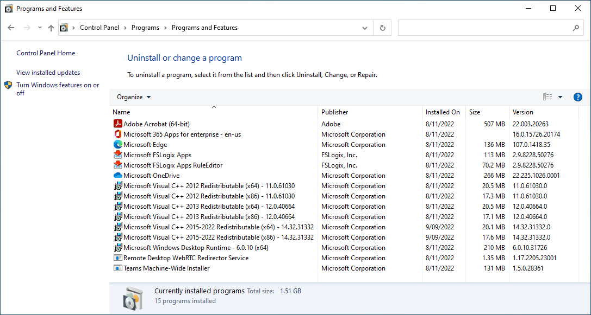

# Azure Virtual Desktop images

## Install scripts

Image scripts for customising Windows 10/11 Enterprise and Enterprise multi-session images for use with Azure Virtual Desktop via Nerdio Manager scripted actions. These scripts can be used to update an existing gold image or session host - where possible, application update features are disabled.

Scripts use [Evergreen](https://stealthpuppy.com/evergreen/) to determine the latest version of an application. Running each script will install the latest version on a clean image or update an existing application install on a gold image or existing session hosts.

Where supported, application installers will save install logs to `$Env:SystemRoot\Logs\ImageBuild`.

| **Script**                    | **Notes**                                                                                                                                                                   |
|-------------------------------|-----------------------------------------------------------------------------------------------------------------------------------------------------------------------------|
| **Core support scripts**          |                                                                                                                                                                             |
| `000_PrepImage.ps1`             | Preps the image for installing updates and applications                                                                                                                     |
| `011_SupportFunctions.ps1`      | Installs or updates [Evergreen](https://stealthpuppy.com/evergreen), [VcRedist](https://vcredist.com) and PSWindowsUpdate PowerShell modules required for installing applications                                                         |
| `012_WindowsUpdate.ps1`         | Installs Windows updates. This script can be run at the beginning and end of creating a desktop image to ensure all updates are installed                                   |
| `013_RegionLanguage.ps1`        | Configures regional/language settings. Use secure variables to pass a system language to this script. Sets `en-AU` by default                                                |
| `014_RolesFeatures.ps1`         | Enable or disables / removes Windows roles, features and capabilities                                                                                                       |
| `015_Customise.ps1`             | Installs Windows Enterprise Defaults. Use secure variables to pass a system language to this script. Sets `en-AU` by default                                                  |
| `101_Avd-Agents.ps1`            | Installs the Azure Virtual Desktop Multimedia Redirection Extensions and the Remote Desktop WebRTC Redirector Service                                                       |
| `102_MicrosoftFSLogixApps.ps1`  | Install the Microsoft FSLogix Apps agent and Rules Editor. Supports secure variables to installed a specified version of the agent                                                                                                                   |
| `103_MicrosoftNET.ps1`          | Installs the Microsoft .NET Windows Desktop Runtime Current and LTS versions                                                                                                |
| `104_MicrosoftEdge.ps1`         | Installs Microsoft Edge and Microsoft Edge WebView2 Runtime. Windows 11 images do not need to run this script                                                               |
| **Microsoft applications**        |                                                                                                                                                                             |
| `200_MicrosoftOneDrive.ps1`     | Installs and updates Microsoft OneDrive per-machine                                                                                                                         |
| `201_MicrosoftTeams.ps1`        | Installs Microsoft Teams per-machine (this script will also update an existing install of Teams)                                                                            |
| `202_Microsoft365Apps.ps1`      | Installs the latest Microsoft 365 Apps for Enterprise, Current channel, 64-bit with shared computer licensing and updates disabled (includes an embedded configuration.xml) |
| **Third party applications**      |                                                                                                                                                                             |
| `400_AdobeAcrobatReaderDC.ps1`  | Installs the latest Adobe Acrobat Reader MUI 64-bit with automatic updates disabled                                                                                         |
| `401_ZoomMeetings.ps1`          | Installs the latest Zoom Meetings VDI client                                                                                                                                |
| `402_FoxitPDReader.ps1`         | Installs the latest Foxit PDF Reader with automatic updates disabled                                                                                                        |
| `403_GoogleChrome.ps1`          | Installs the latest Google Chrome 64-bit with automatic updates disabled                                                                                                    |
| `404_NotepadPlusPlus.ps1`       | Installs the latest Notepad++ 64-bit with automatic updates disabled                                                                                                        |
| `405_pdfforgePDFCreator.ps1`    | Installs the latest PDFForge PDFCreator (note: this is not the Terminal Server edition)                                                                                     |
| `406_VLCMediaPlayer.ps1`        | Installs the latest VLC media player 64-bit                                                                                                                                 |
| `407_7Zip.ps1`                  | Installs the latest 7-Zip 64-bit                                                                                                                                            |
| `408_RemoteDesktopAnalyzer.ps1` | Downloads the Remote Display Analyzer to `C:\Program Files\RemoteDisplayAnalyzer`                                                                                             |
| `409_CiscoWebEx.ps1`            | Installs the specified version of Cisco WebEx VDI client with automatic updates disabled. Note: the URL to the installer is hard coded in this script                       |
| `410_ImageGlass.ps1`            | Installs the latest version of ImageGlass. Use a replacement for the Photos app                                                                                             |
| `411_draw.io.ps1`               | Installs the latest version of draw.io / diagrams.net                                                                                                                       |
| `412_MozillaFirefox.ps1`        | Installs the latest of Mozilla Firefox 64-bit en-US with updates disabled                                                                                                   |
| `413_Paint.NET`                 | Installs the latest of paint.net 64-bit with updates disabled                                                                                                               |
| **Clean up scripts**             |                                                                                                                                                                             |
| `999_CleanupImage.ps1`          | Cleans up the image post install and update (e.g., removes `C:\Apps`). This script should be run at the end of any deployment                                                 |

Once run on the target VM, the VM or image should have the specified applications installed:

