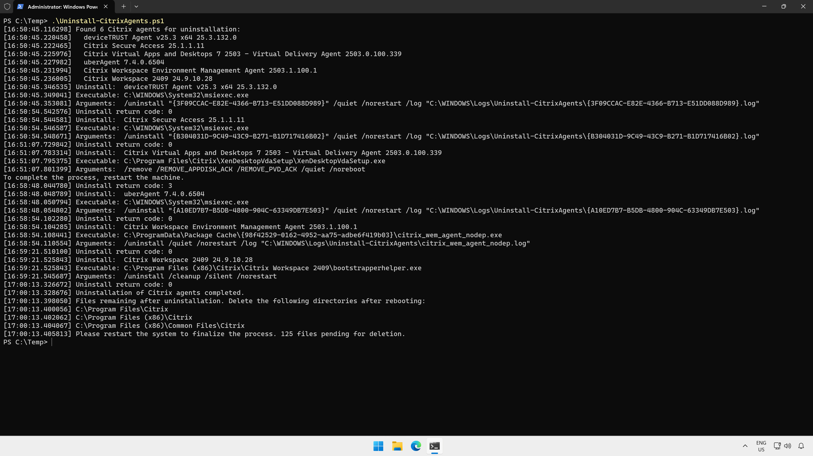

# Migration scripts

To prepare a virtual machine to be migrated from a third party virtual desktop solution to Azure Virtual Desktop or Windows 365, scripts here can be used to uninstall third party agents.

## Uninstall-CitrixAgents.ps1

Uninstalls Citrix agents on a Windows virtual machine. This script queries the local system for installed Win32 software from Citrix Systems, Inc. and vast limits GmbH, determines the uninstall strings for each installed application and uninstalls the application. Actions are logged to `C:\Windows\Logs\Uninstall-CitrixAgents`.

You may need to run the script twice - in some cases, the Virtual Delivery Agent does not completely uninstall and requires a reboot before running the uninstall script again.

It is recommended that the target virtual machine is restarted before running the script. Additionally, a reboot is required after running the script to enable the agents to be completely removed after uninstall. Some log files will be left behind in the Program Files directories after uninstall.

Here's what the uninstall process looks like:

