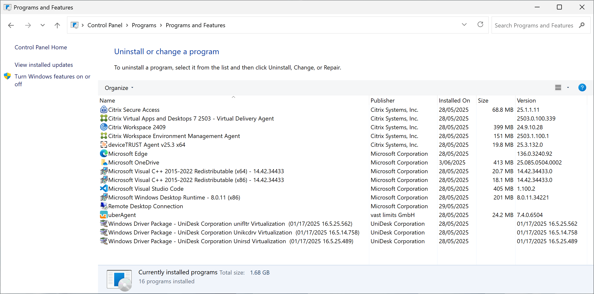
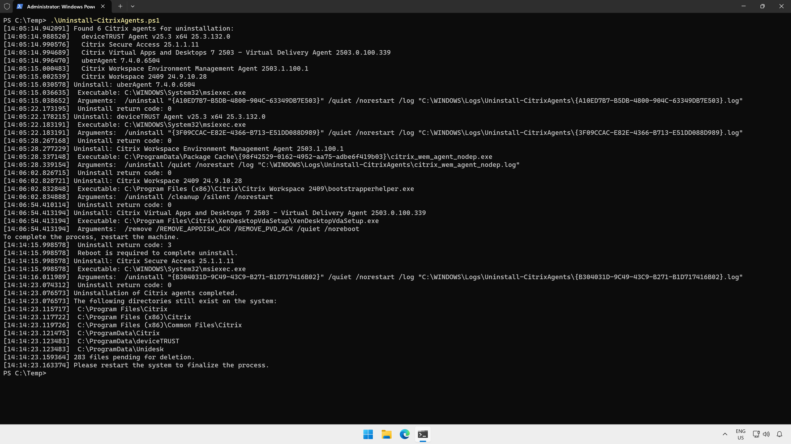
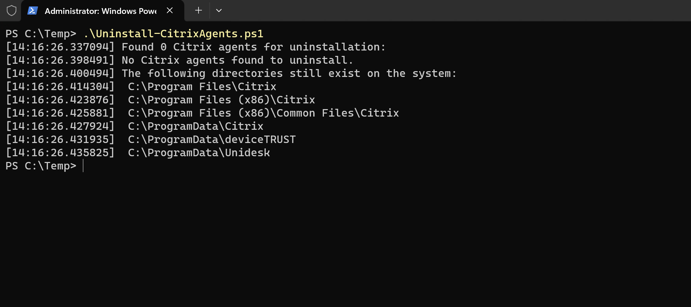
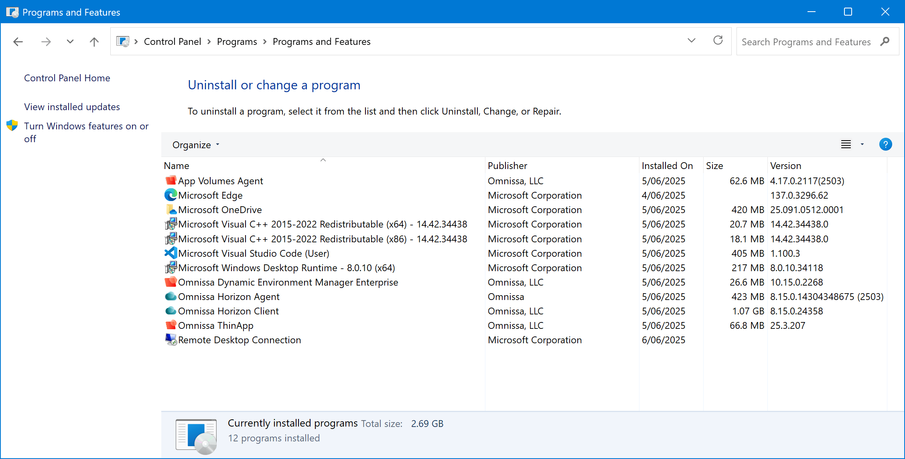
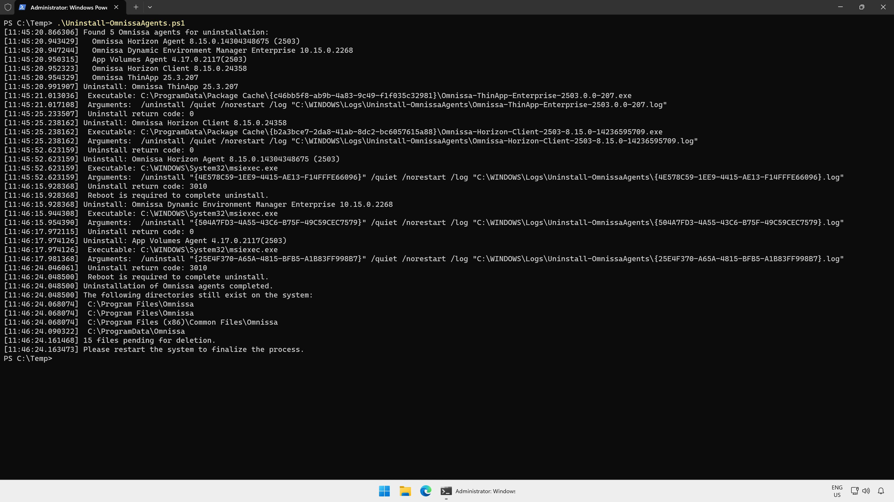
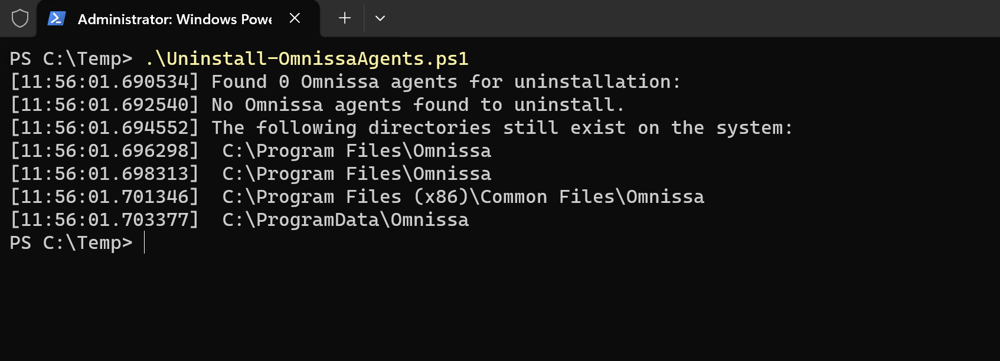

# Migration scripts

To prepare a virtual machine to be migrated from a third party virtual desktop solution to Azure Virtual Desktop or Windows 365, scripts here can be used to uninstall third party agents.

> [!WARNING]  
> Uninstall scripts will uninstall target agents without confirmation. Use the `-WhatIf` parameter to determine which software will be uninstalled.

> [!CAUTION]
> The `Remove-` scripts will delete directories and registry keys. Use Use the `-WhatIf` parameter to determine which directories and keys will be removed.

## Citrix

### Uninstall-CitrixAgents.ps1

Uninstalls Citrix agents on a Windows virtual machine. This script queries the local system for installed Win32 software from Citrix Systems, Inc. and vast limits GmbH, determines the uninstall strings for each installed application and uninstalls the application. Actions are logged to `C:\Windows\Logs\Uninstall-CitrixAgents`.



Run the script to uninstall agents - no parameters are required:

```powershell
Uninstall-CitrixAgents.ps1
```

You may need to run the script twice - in some cases, the Virtual Delivery Agent does not completely uninstall and requires a reboot before running the uninstall script again.

It is recommended that the target virtual machine is restarted before running the script. Additionally, a reboot is required after running the script to enable the agents to be completely removed after uninstall. Some log files will be left behind in the Program Files directories after uninstall.

Here's what the uninstall process looks like:



### Remove-CitrixPaths.ps1

After uninstalling the Citrix agents, if you run `Uninstall-CitrixAgents.ps1` again, the following output will be displayed where some directories may remain on the system:



`Uninstall-CitrixAgents.ps1` does not remove these paths. To remove the remaining file system directories and registry entries, `Remove-CitrixPaths.ps1` can be used. This script supports the `-WhatIf` parameter to determine what will be removed. Actions are logged to `C:\Windows\Logs\Uninstall-CitrixAgents`.

When running this script to remove data from the current system, the `-Confirm` parameter is required:

```powershell
Remove-CitrixPaths.ps1 -Confirm:$false
```

## Omnissa

### Uninstall-OmnissaAgents.ps1

Uninstalls Omnissa agents on a Windows virtual machine. This script queries the local system for installed Win32 software from Omnissa, LLC and Omnissa, determines the uninstall strings for each installed application and uninstalls the application. Actions are logged to `C:\Windows\Logs\Uninstall-OmnissaAgents`.



Run the script to uninstall agents - no parameters are required:

```powershell
Uninstall-OmnissaAgents.ps1
```

You may need to run the script twice - in some cases, the Virtual Delivery Agent does not completely uninstall and requires a reboot before running the uninstall script again.

It is recommended that the target virtual machine is restarted before running the script. Additionally, a reboot is required after running the script to enable the agents to be completely removed after uninstall. Some log files will be left behind in the Program Files directories after uninstall.

Here's what the uninstall process looks like:



### Remove-OmnissaPaths.ps1

After uninstalling the Omnissa agents, if you run `Uninstall-OmnissaAgents.ps1` again, the following output will be displayed where some directories may remain on the system:



`Uninstall-OmnissaAgents.ps1` does not remove these paths. To remove the remaining file system directories and registry entries, `Remove-OmnissaPaths.ps1` can be used. This script supports the `-WhatIf` parameter to determine what will be removed. Actions are logged to `C:\Windows\Logs\Uninstall-OmnissaAgents`.

When running this script to remove data from the current system, the `-Confirm` parameter is required:

```powershell
Remove-OmnissaPaths.ps1 -Confirm:$false
```
